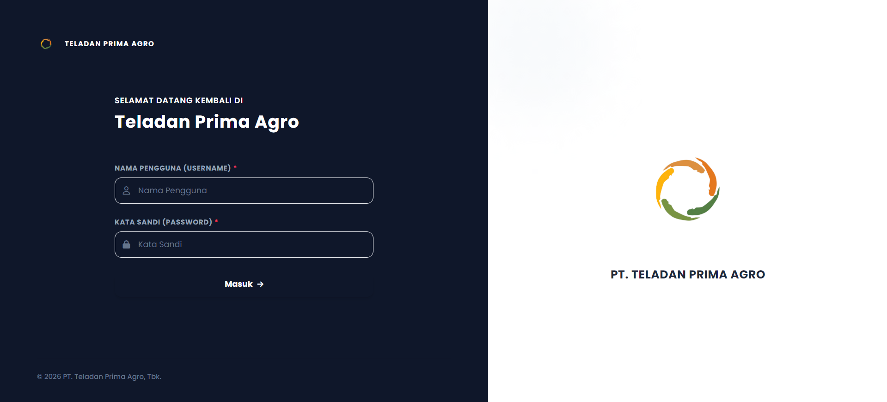

<div align="center">
  

  <h1>Heavy Equipment Monitoring Dashboard</h1>

  <p>
    Aplikasi web berbasis Laravel untuk memantau data operasional, penggunaan bahan bakar, dan performa aset berat Anda secara <i>real-time</i>.
  </p>

  <!-- Badges -->
  <p>
    
    
    
  </p>
</div>

<br/>

## 📋 Daftar Isi
- [Tentang Proyek](#-tentang-proyek)
- [Fitur Utama](#-fitur-utama)
- [Teknologi yang Digunakan](#-teknologi-yang-digunakan)
- [Tangkapan Layar (Screenshots)](#-tangkapan-layar)
- [Memulai (Getting Started)](#-memulai-getting-started)

---

## 📖 Tentang Proyek

Sistem informasi ini dirancang khusus untuk mengelola dan menganalisis operasional alat berat. Dengan antarmuka yang ramah pengguna, manajemen dapat dengan mudah melacak jam kerja (working hours), waktu menganggur (idle), hingga tingkat efisiensi bahan bakar (fuel usage) dari setiap armada.

## ✨ Fitur Utama

- **📊 Dashboard Overview** — Ringkasan metrik utama, grafik operasional, dan efisiensi harian.
- **📑 Pelaporan Terperinci** — Ekstrak data berdasarkan area, grup, dan grup IO secara dinamis.
- **📥 Import Cerdas** — Integrasi mulus untuk mengunggah berkas Excel (Fleet Utilization & Fuel).
- **📤 Export Data** — Unduh laporan komprehensif ke format Excel untuk kebutuhan audit/analisis.
- **🔐 Keamanan Role-Based** — Akses yang disesuaikan untuk Admin dan User biasa.
- **🌍 Multi-bahasa (I18n)** — Beralih secara instan antara Bahasa Indonesia dan Bahasa Inggris.

## 🛠 Teknologi yang Digunakan

Proyek ini dibangun menggunakan teknologi modern:
- **Backend:** PHP 8.4, Laravel 13
- **Database:** MySQL
- **Frontend:** Blade Templating, Vite, Chart.js
- **Ekstensi:** Maatwebsite Excel (Export/Import)

## 📷 Tangkapan Layar

> *Placeholder: Anda bisa menambahkan screenshot aplikasi di sini* 

| Dashboard | Laporan |
| :---: | :---: |
|  |  |

## 🚀 Memulai (Getting Started)

Ikuti instruksi di bawah ini untuk menjalankan proyek ini di mesin lokal Anda.

### Prasyarat
Pastikan Anda sudah menginstal:
- [PHP](https://www.php.net/) (>= 8.4)
- [Composer](https://getcomposer.org/)
- [Node.js & npm](https://nodejs.org/)
- [MySQL](https://www.mysql.com/)

### Instalasi

1. **Clone repository** (jika ada):
   ```bash
   git clone https://github.com/username/dashboard_monitor.git
   cd dashboard_monitor
   ```

2. **Install dependensi PHP & Node:**
   ```bash
   composer install
   npm install
   ```

3. **Konfigurasi Environment:**
   Salin berkas konfigurasi lalu sesuaikan pengaturan database Anda (`DB_DATABASE=monitoring_alat`).
   ```bash
   cp .env.example .env
   php artisan key:generate
   ```

4. **Migrasi Database:**
   ```bash
   php artisan migrate
   ```

5. **Jalankan Server:**
   Buka dua terminal dan jalankan perintah ini secara bersamaan:
   ```bash
   php artisan serve
   ```
   ```bash
   npm run dev
   ```
   Aplikasi dapat diakses melalui `http://localhost:8000`.

---
<div align="center">
Dibuat dengan ❤️ oleh tim pengembang.
</div>
